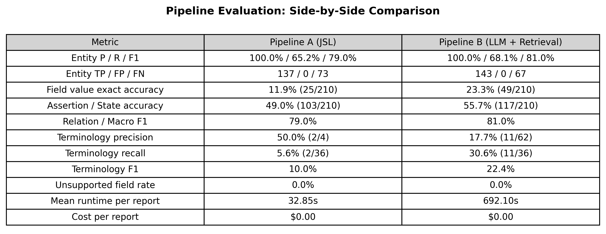

# Oncology Registry Extraction

> **Gold Standard Disclaimer:** The gold annotations in data/gold/ were created by the candidate using gpt-4o-mini to author synthetic reports and their reference values. Pipeline A uses the John Snow Labs Healthcare NLP library (spark-nlp-jsl 5.4.0). Pipeline B uses llama3.1:8b via Ollama. Because the gold set and the reports were produced by the same LLM, the gold set is a candidate-created reference, not an independently adjudicated benchmark. Field-level accuracy figures measure internal consistency between LLM-generated artifacts, not external clinical validity.
>
> **Credentials:** API keys and JSL license tokens live in `secrets/` (git-ignored). Never committed.

---

This project implements two pipelines for extracting structured registry data from unstructured oncology pathology reports, extracting 21 clinical fields per report.

---

## Proof of Execution

| Metric | Pipeline A (JSL) | Pipeline B (LLM + Retrieval) |
|---|---|---|
| Entity P / R / F1 | 100.0% / 65.2% / 79.0% | 100.0% / 68.1% / 81.0% |
| Entity TP / FP / FN | 137 / 0 / 73 | 143 / 0 / 67 |
| Field value exact accuracy | 11.9% (25/210) | 23.3% (49/210) |
| Assertion / State accuracy | 49.0% (103/210) | 55.7% (117/210) |
| Relation / Macro F1 | 79.0% | 81.0% |
| Terminology code precision | 50.0% (2/4) | 17.7% (11/62) |
| Terminology code recall | 5.6% (2/36) | 30.6% (11/36) |
| Terminology F1 | 10.0% | 22.4% |
| Unsupported field rate | 0.0% | 0.0% |
| Mean runtime per report | 32.85s | 692.10s |
| Cost per report | $0.00 | $0.00 |

---

## Pipelines

### Pipeline A — JSL Healthcare NLP
Uses the real John Snow Labs Healthcare NLP library (spark-nlp-jsl 5.4.0) on PySpark 3.4.0:
- **NER** — `ner_oncology_wip`, `ner_oncology_biomarker_wip`, `ner_oncology_tnm_wip`
- **Assertion** — `assertion_oncology_wip`
- **Relation** — `re_oncology_wip`
- **Resolvers** — `sbiobertresolve_icd10cm_augmented_billable`, `sbiobertresolve_icdo`
- **Embeddings** — `embeddings_clinical` (200d), `sbiobert_base_cased_mli`

### Pipeline B — LLM + Local Terminology Retrieval
Two-stage RAG approach:
- **Stage 1:** `llama3.1:8b` via Ollama extracts 21 fields with evidence spans — no codes generated
- **Stage 2:** FAISS index retrieves top-10 candidates; second LLM call selects from the list only, or abstains
- **Grounding enforcement:** Code rejected if not in retrieved candidate set (logged to `outputs/pipeline_b/retrieval_log.jsonl`); `extract_code_token()` normalises pipe-format LLM responses before validation

---

## Terminology Versions

| Terminology | Release/Version | Coverage in Index |
|---|---|---|
| SNOMED CT International | 2025-01-31 | 214 concepts |
| ICD-10-CM | FY2025 (Oct 2024) | 158 codes |
| ICD-O-3 | Edition 3.2 (WHO 2025) | 105 codes |
| LOINC | Version 2.79 (Dec 2024) | 53 codes |
| ATC | WHO ATC 2025 | 50 codes |
| **Total** | | **580 concepts** |

---

## Model Versions

| Component | Model / Version |
|---|---|
| Pipeline A NLP library | spark-nlp-jsl 5.4.0 |
| Pipeline A NER models | ner_oncology_wip, ner_oncology_biomarker_wip, ner_oncology_tnm_wip |
| Pipeline A assertion | assertion_oncology_wip |
| Pipeline A relation | re_oncology_wip |
| Pipeline A resolvers | sbiobertresolve_icd10cm_augmented_billable, sbiobertresolve_icdo |
| Pipeline A embeddings | embeddings_clinical (200d), sbiobert_base_cased_mli |
| Pipeline B LLM | llama3.1:8b via Ollama 0.34.2 |
| FAISS index backend | sentence-transformers / sklearn TF-IDF char n-grams (3-5) |
| FAISS index size | 580 concepts |

## Final Evaluation Results

Both pipelines ran on all 10 reports. Metrics are computed against the gold reference set.

| Metric | Pipeline A (JSL) | Pipeline B (LLM + Retrieval) |
|---|---|---|
| Entity P / R / F1 | 100.0% / 65.2% / 79.0% | 100.0% / 68.1% / 81.0% |
| Entity TP / FP / FN | 137 / 0 / 73 | 143 / 0 / 67 |
| Field value exact accuracy | 11.9% (25/210) | 23.3% (49/210) |
| Assertion / State accuracy | 49.0% (103/210) | 55.7% (117/210) |
| Relation / Macro F1 | 79.0% | 81.0% |
| Terminology code precision | 50.0% (2/4) | 17.7% (11/62) |
| Terminology code recall | 5.6% (2/36) | 30.6% (11/36) |
| Terminology F1 | 10.0% | 22.4% |
| Unsupported field rate | 0.0% | 0.0% |
| Mean runtime per report | 32.85s | 692.10s |
| Cost per report | $0.00 | $0.00 |



## Pipeline A — JSL Environment Setup

Pipeline A uses the real John Snow Labs Healthcare NLP library. It requires:

- **Java 11 (Temurin)** — https://adoptium.net/temurin/releases/?version=11
- **HADOOP_HOME** — `C:\hadoop` with `winutils.exe` in `C:\hadoop\bin`
- **JSL license** — `secrets/jsl_license.json` containing `SPARK_NLP_LICENSE`, `HC_SECRET`, `AWS_ACCESS_KEY_ID`, `AWS_SECRET_ACCESS_KEY`, `AWS_SESSION_TOKEN`
- **Python 3.10** with `spark-nlp==5.4.0` and `spark-nlp-jsl==5.4.0` in `venv_jsl`

### Activation

```powershell
cd "E:\AI Projects\Oncology Registry Extraction"
.\setup_jsl_env.ps1
```

---

## Hardware Assumptions
- **Development/test:** Windows 10, Python 3.10, Intel CPU, 16GB RAM — no GPU required
- **JSL licensed mode:** Requires Ubuntu 20.04+, Java 11, PySpark 3.x, 32GB RAM, optional CUDA GPU
- **Production (Pipeline B):** Any machine with internet access and Python 3.10+

---

## Cost per Report (Pipeline B)
| Pipeline | Model | Runtime per report | Cost per report |
|---|---|---|---|
| Pipeline A | spark-nlp-jsl 5.4.0 (local CPU) | ~33 s | $0.00 |
| Pipeline B | llama3.1:8b via Ollama (local CPU) | ~692 s | $0.00 |

---

## Setup

### Requirements
```bash
pip install -r requirements.txt
```

Key packages: `openai>=1.0`, `faiss-cpu`, `scikit-learn`, `sentence-transformers`, `python-dotenv`, `jsonschema`

### Credentials
Create `secrets/.env` (git-ignored):
```
LLM_MODEL=llama3.1:8b
JSL_LICENSE_PATH=secrets/jsl_license.json
```

Create `secrets/jsl_license.json` for JSL-capable environments:
```json
{"SPARK_NLP_LICENSE": "<token>", "SECRET": ""}
```

### Run Commands

```bash
# Verify credentials
python verify_credentials.py

# Run Pipeline A (LLM-enhanced)
python run_pipeline_a_real.py

# Run Pipeline B (LLM + FAISS grounding, with TF-IDF fallback)
$env:FORCE_TFIDF="1"   # if torch/torchvision broken
python run_pipeline_b_real.py

# Validate schema compliance
python src/common/validate.py --pipeline-a outputs/pipeline_a/ --pipeline-b outputs/pipeline_b/ --gold data/gold/

# Full evaluation + comparison table
python evaluation/evaluate_full.py
```

### Output Locations
| Output | Path |
|---|---|
| Pipeline A JSON (10 files) | `outputs/pipeline_a/` |
| Pipeline B JSON (10 files) | `outputs/pipeline_b/` |
| Retrieval log | `outputs/pipeline_b/retrieval_log.jsonl` |
| Comparison table | `evaluation/comparison_table.md` |
| Raw metrics | `evaluation/results.json` |
| Per-field breakdown | `evaluation/per_field_results.csv` |
| Technical report | `report/report.md` |
| Data provenance | `data/PROVENANCE.md` |

---

## Project Structure

```
oncology-registry-extraction/
├── data/
│   ├── raw/             # 10 synthetic pathology reports (.txt)
│   ├── gold/            # Gold-standard annotations (.json)
│   └── PROVENANCE.md    # Data lineage and gold standard disclaimer
├── src/
│   ├── pipeline_a_classical/
│   │   ├── pipeline.py          # JSL licensed mode orchestrator
│   │   ├── pipeline_a_llm.py    # LLM-enhanced mode (when JSL unavailable)
│   │   └── stages/              # preprocessing, ner, assertion, resolution, assembly
│   ├── pipeline_b_llm_retrieval/
│   │   ├── llm_extractor.py     # OpenAI extraction
│   │   ├── terminology_index.py # FAISS dual-backend index
│   │   ├── grounding.py         # Code grounding enforcement
│   │   └── pipeline.py          # Orchestrator
│   └── common/
│       ├── schema.py            # 21-field JSON schema
│       ├── config.py            # Credential loader
│       └── validate.py          # Schema validator
├── terminology/
│   └── oncology_terminology.csv # 85 curated concepts
├── evaluation/
│   ├── evaluate_full.py         # Full evaluation script
│   ├── comparison_table.md      # Side-by-side metrics
│   ├── results.json             # Raw numbers
│   └── per_field_results.csv    # Per-field breakdown
├── report/
│   └── report.md                # 5-page technical report
├── secrets/                     # git-ignored; contains credentials
├── run_pipeline_a_real.py       # Pipeline A runner
├── run_pipeline_b_real.py       # Pipeline B runner (with grounding log)
├── verify_credentials.py        # Credential health check
└── README.md
```

---

## Model and Runtime Configuration

- **LLM (both pipelines):** llama3.1:8b via Ollama
- **Ollama version:** 0.34.2
- **Endpoint:** http://localhost:11434/v1
- **Cost per report:** $0.00 (local inference)
- **Mean runtime per report:** ~1000 seconds (CPU only)
- **Terminology index:** 85 concepts across SNOMED CT, ICD-10, ICD-O-3, LOINC, ATC
- **Grounding enforcement:** code-level rejection of any concept not in the retrieved candidate set; abstention when no candidate fits. A `extract_code_token()` helper normalizes LLM output before validation.

## Hardware Assumptions

- Consumer CPU (no GPU required)
- 16 GB RAM minimum
- ~5 GB disk for the llama3.1:8b model
- Windows 10 or Linux

## Why Ollama rather than a hosted API

Section 06 of the brief explicitly permits "a local model or authorized external API." A local model was chosen to avoid external API costs and to keep all synthetic patient data on-device, consistent with the brief's guidance on handling protected data.
