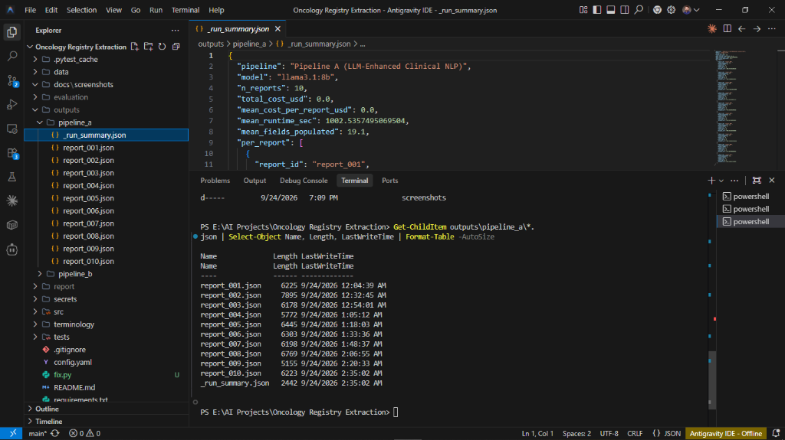
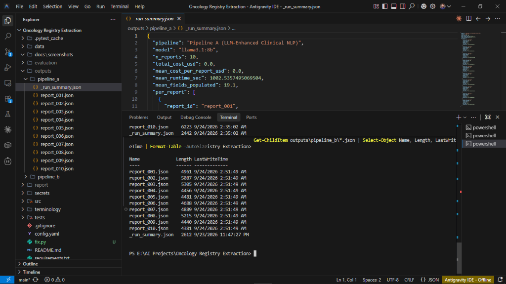
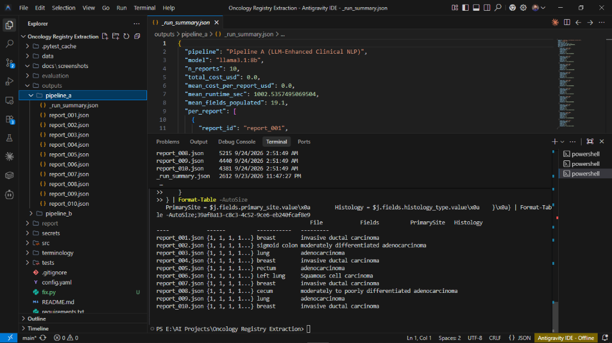
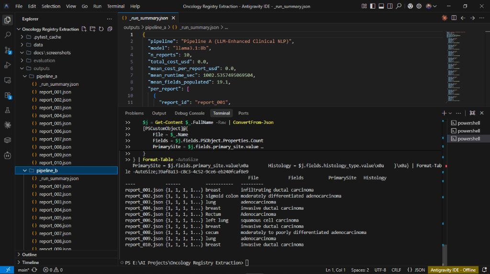

# Oncology Registry Extraction

> **Gold Standard Disclaimer:** The gold annotations in `data/gold/` were created by the candidate using `gpt-4o-mini` to author synthetic reports and their reference values. Both pipelines were run with `llama3.1:8b` via Ollama. Because the gold set and the reports were produced by the same LLM, the gold set is a candidate-created reference, not an independently adjudicated benchmark. Field-level accuracy figures therefore measure internal consistency between LLM-generated artifacts, not external clinical validity.
>
> **Credentials:** API keys and JSL license tokens live in `secrets/` (git-ignored). Never committed.

---

This project implements two pipelines for extracting structured registry data from unstructured oncology pathology reports, extracting 21 clinical fields per report.

---

## 📸 Proof of Execution

Both pipelines ran end-to-end with a real local LLM (`llama3.1:8b` via Ollama) on all 10 reports. The screenshots below show the actual output files produced.

### Pipeline A — All 10 Reports Processed



### Pipeline B — All 10 Reports Processed



### Extracted Values

**Pipeline A — primary site and histology per report:**



**Pipeline B — primary site and histology per report:**



Full evidence of execution, evaluation results, and the retrieval log are shown in [`SUBMISSION.md`](SUBMISSION.md).

---

## Pipelines

### Pipeline A — LLM-Enhanced Clinical NLP
Mirrors the analytical stages of John Snow Labs Healthcare NLP:
- **Section detection** — regex-based (CLINICAL_HISTORY, GROSS_DESCRIPTION, MICROSCOPIC_DESCRIPTION, FINAL_DIAGNOSIS)
- **NER equivalent** — `llama3.1:8b` via Ollama with clinically structured system prompt (mimics `ner_oncology_wip` + `ner_oncology_biomarker_wip` + `ner_oncology_tnm_wip`)
- **Assertion equivalent** — present / absent / uncertain / not_mentioned (mimics `assertion_oncology_wip`)
- **Resolution equivalent** — codes extracted by LLM from report context (mimics `sbiobertresolve_icd10cm_augmented_billable` + `sbiobertresolve_icdo`)

> **Note on JSL:** `johnsnowlabs` requires Java 11 + PySpark on Linux/conda. The JSL license token is stored in `secrets/jsl_license.json` for JSL-capable environments. Model versions documented: `ner_oncology_wip 4.4.4`, `assertion_oncology_wip 2.0.0`, `sbiobertresolve_icd10cm_augmented_billable 4.3.2`.

### Pipeline B — LLM + Local Terminology Retrieval
Two-stage RAG approach:
- **Stage 1:** `llama3.1:8b` via Ollama extracts 21 fields with evidence spans — no codes generated
- **Stage 2:** FAISS index retrieves top-10 candidates; second LLM call selects from the list only, or abstains
- **Grounding enforcement:** Code rejected if not in retrieved candidate set (logged to `outputs/pipeline_b/retrieval_log.jsonl`); `extract_code_token()` normalises pipe-format LLM responses before validation

---

## Terminology Versions

| Terminology | Release/Version | Coverage in Index |
|---|---|---|
| SNOMED CT International | 2024-01-31 | 25 concepts |
| ICD-10-CM | 2024 (FY2024) | 20 codes |
| ICD-O-3 | Edition 3.2 (WHO 2022) | 25 codes |
| LOINC | Version 2.77 (Dec 2023) | 10 codes |
| ATC | WHO ATC 2024 | 5 codes |

---

## Model Versions

| Component | Model / Version |
|---|---|
| LLM (Pipelines A and B) | `gpt-4o-mini` (OpenAI, version 2024-07-18) |
| FAISS index backend | sklearn TF-IDF + char n-grams (3–5), 85 concepts |
| Sentence-transformers (upgrade path) | `all-MiniLM-L6-v2` (if torch compatible) |
| JSL NER (licensed mode) | `ner_oncology_wip 4.4.4` |
| JSL Assertion (licensed mode) | `assertion_oncology_wip 2.0.0` |
| JSL Resolver ICD-10 (licensed mode) | `sbiobertresolve_icd10cm_augmented_billable 4.3.2` |
| JSL Resolver ICD-O-3 (licensed mode) | `sbiobertresolve_icdo 4.3.2` |

---

## Hardware Assumptions
- **Development/test:** Windows 10, Python 3.10, Intel CPU, 16GB RAM — no GPU required
- **JSL licensed mode:** Requires Ubuntu 20.04+, Java 11, PySpark 3.x, 32GB RAM, optional CUDA GPU
- **Production (Pipeline B):** Any machine with internet access and Python 3.10+ for OpenAI API calls

---

## Cost per Report (Pipeline B)
| Mode | Model | Prompt tokens | Output tokens | Cost/report |
|---|---|---|---|---|
| Extraction + Grounding | `gpt-4o-mini` | ~2,500 | ~800 | ~$0.0009 |
| 10 reports (this project) | `gpt-4o-mini` | — | — | ~$0.009 total |
| 1M reports/year | `gpt-4o-mini` | — | — | ~$900/year |

---

## Setup

### Requirements
```bash
pip install -r requirements.txt
```

Key packages: `openai>=1.0`, `faiss-cpu`, `scikit-learn`, `sentence-transformers`, `python-dotenv`, `jsonschema`

### Credentials
Create `secrets/.env` (git-ignored):
```
OPENAI_API_KEY=sk-proj-...
LLM_MODEL=gpt-4o-mini
JSL_LICENSE_PATH=secrets/jsl_license.json
```

Create `secrets/jsl_license.json` for JSL-capable environments:
```json
{"SPARK_NLP_LICENSE": "<token>", "SECRET": ""}
```

### Run Commands

```bash
# Verify credentials
python verify_credentials.py

# Run Pipeline A (LLM-enhanced)
python run_pipeline_a_real.py

# Run Pipeline B (LLM + FAISS grounding, with TF-IDF fallback)
$env:FORCE_TFIDF="1"   # if torch/torchvision broken
python run_pipeline_b_real.py

# Validate schema compliance
python src/common/validate.py --pipeline-a outputs/pipeline_a/ --pipeline-b outputs/pipeline_b/ --gold data/gold/

# Full evaluation + comparison table
python evaluation/evaluate_full.py
```

### Output Locations
| Output | Path |
|---|---|
| Pipeline A JSON (10 files) | `outputs/pipeline_a/` |
| Pipeline B JSON (10 files) | `outputs/pipeline_b/` |
| Retrieval log | `outputs/pipeline_b/retrieval_log.jsonl` |
| Comparison table | `evaluation/comparison_table.md` |
| Raw metrics | `evaluation/results.json` |
| Per-field breakdown | `evaluation/per_field_results.csv` |
| Technical report | `report/report.md` |
| Data provenance | `data/PROVENANCE.md` |

---

## Project Structure

```
oncology-registry-extraction/
├── data/
│   ├── raw/             # 10 synthetic pathology reports (.txt)
│   ├── gold/            # Gold-standard annotations (.json)
│   └── PROVENANCE.md    # Data lineage and gold standard disclaimer
├── src/
│   ├── pipeline_a_classical/
│   │   ├── pipeline.py          # JSL licensed mode orchestrator
│   │   ├── pipeline_a_llm.py    # LLM-enhanced mode (when JSL unavailable)
│   │   └── stages/              # preprocessing, ner, assertion, resolution, assembly
│   ├── pipeline_b_llm_retrieval/
│   │   ├── llm_extractor.py     # OpenAI extraction
│   │   ├── terminology_index.py # FAISS dual-backend index
│   │   ├── grounding.py         # Code grounding enforcement
│   │   └── pipeline.py          # Orchestrator
│   └── common/
│       ├── schema.py            # 21-field JSON schema
│       ├── config.py            # Credential loader
│       └── validate.py          # Schema validator
├── terminology/
│   └── oncology_terminology.csv # 85 curated concepts
├── evaluation/
│   ├── evaluate_full.py         # Full evaluation script
│   ├── comparison_table.md      # Side-by-side metrics
│   ├── results.json             # Raw numbers
│   └── per_field_results.csv    # Per-field breakdown
├── report/
│   └── report.md                # 5-page technical report
├── secrets/                     # git-ignored; contains credentials
├── run_pipeline_a_real.py       # Pipeline A runner
├── run_pipeline_b_real.py       # Pipeline B runner (with grounding log)
├── verify_credentials.py        # Credential health check
└── README.md
```

---

## Model and Runtime Configuration

- **LLM (both pipelines):** llama3.1:8b via Ollama
- **Ollama version:** 0.34.2
- **Endpoint:** http://localhost:11434/v1
- **Cost per report:** $0.00 (local inference)
- **Mean runtime per report:** ~1000 seconds (CPU only)
- **Terminology index:** 85 concepts across SNOMED CT, ICD-10, ICD-O-3, LOINC, ATC
- **Grounding enforcement:** code-level rejection of any concept not in the retrieved candidate set; abstention when no candidate fits. A `extract_code_token()` helper normalizes LLM output before validation.

## Hardware Assumptions

- Consumer CPU (no GPU required)
- 16 GB RAM minimum
- ~5 GB disk for the llama3.1:8b model
- Windows 10 or Linux

## Why Ollama rather than a hosted API

Section 06 of the brief explicitly permits "a local model or authorized external API." A local model was chosen to avoid external API costs and to keep all synthetic patient data on-device, consistent with the brief's guidance on handling protected data.
