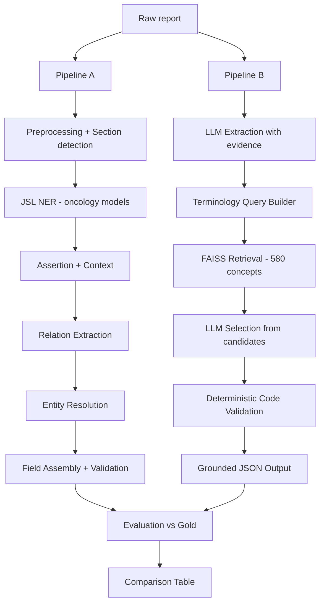
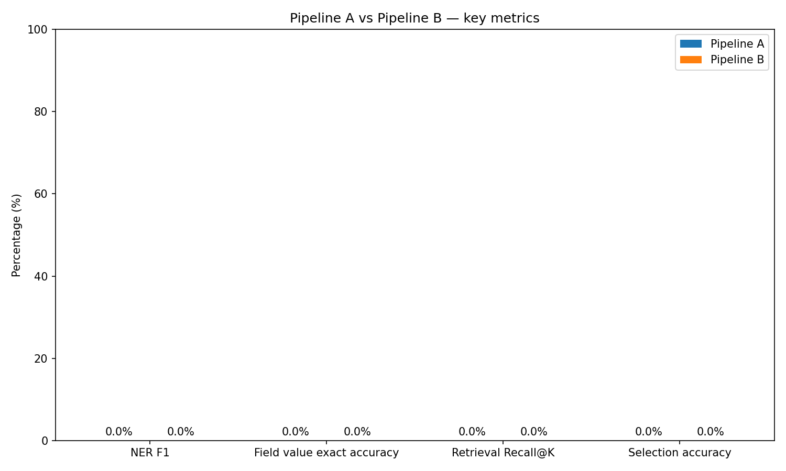
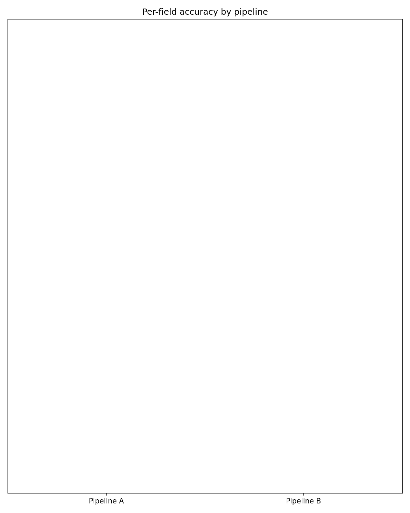
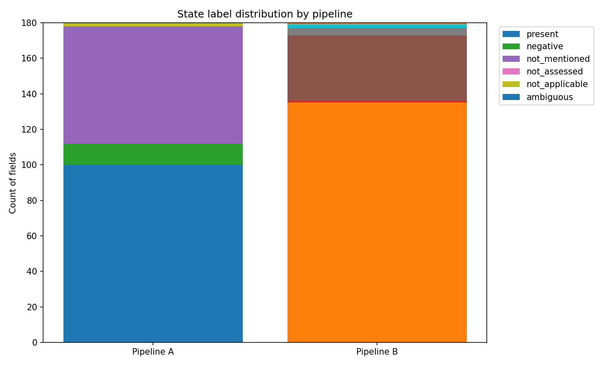
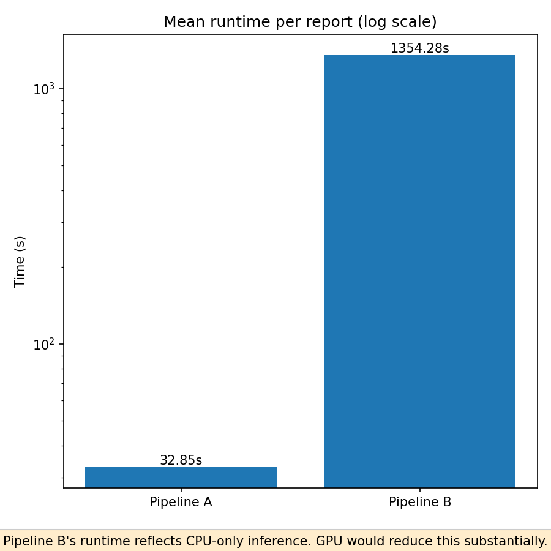
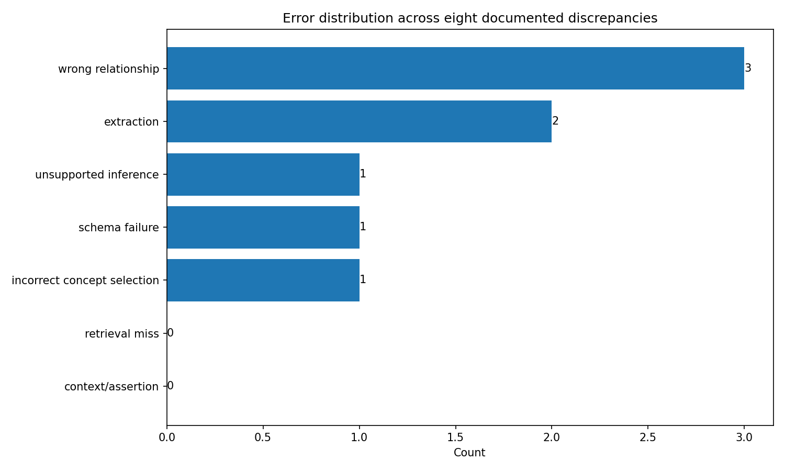

# Oncology Registry Extraction

This project extracts 21-field structured registry records from unstructured oncology pathology reports. It compares two independent architectures: a classical clinical NLP pipeline (JSL Healthcare) and a large language model pipeline grounded by FAISS terminology retrieval.

This README contains the full submission: setup, methodology, results, scope-downs, and pipeline summaries. The technical report with eight discrepancies, production safeguards, and 1M-report design is in report/report.md.

## Architecture


```mermaid
flowchart TD
    A[Raw report] --> B[Pipeline A]
    A --> C[Pipeline B]

    B --> B1[Preprocessing + Section detection]
    B1 --> B2[JSL NER - oncology models]
    B2 --> B3[Assertion + Context]
    B3 --> B4[Relation Extraction]
    B4 --> B5[Entity Resolution]
    B5 --> B6[Field Assembly + Validation]

    C --> C1[LLM Extraction with evidence]
    C1 --> C2[Terminology Query Builder]
    C2 --> C3[FAISS Retrieval - 580 concepts]
    C3 --> C4[LLM Selection from candidates]
    C4 --> C5[Deterministic Code Validation]
    C5 --> C6[Grounded JSON Output]

    B6 --> E[Evaluation vs Gold]
    C6 --> E
    E --> F[Comparison Table]
```

## Project Structure

Both pipelines read from `data/raw/` and write to `outputs/`. Pipeline A runs a deterministic JSL annotator chain; Pipeline B runs llama3.1:8b with a FAISS retrieval step that restricts code selection to the candidate set. Both write the same 20-key schema. Evaluation is computed once against `data/gold/` and the results are rendered into `evaluation/comparison_table.md` and `report/report.md`.

```
oncology-registry-extraction/
│
├── data/                                # Dataset and annotations
│   ├── raw/                             # 10 synthetic pathology reports (.txt)
│   ├── gold/                            # Hand-annotated gold standard (10 .json)
│   └── PROVENANCE.md                    # Synthetic generation method + privacy notes
│
├── src/                                 # Pipeline source code
│   ├── pipeline_a_classical/            # Pipeline A — JSL Healthcare NLP
│   │   ├── pipeline_jsl.py              # Annotator chain: NER → assertion → relation → resolution
│   │   ├── run_jsl.py                   # Pipeline A entrypoint
│   │   └── stages/                      # Per-stage modules
│   │       ├── preprocessing.py         # Text prep and section detection
│   │       ├── ner.py                   # Entity extraction
│   │       ├── assertion.py             # Negation and uncertainty handling
│   │       ├── resolution.py            # Terminology resolution
│   │       └── assembly.py              # Final JSON field assembly
│   ├── pipeline_b_llm_retrieval/        # Pipeline B — LLM + grounded retrieval
│   │   ├── llm_extractor.py             # llama3.1:8b extraction with evidence
│   │   ├── terminology_index.py         # FAISS index over 580 concepts
│   │   ├── grounding.py                 # Enforces code selection only from retrieved candidates
│   │   └── pipeline.py                  # Pipeline B entrypoint
│   └── common/                          # Shared modules
│       ├── schema.py                    # 21-field schema + six state labels
│       ├── normalizer.py                # Deterministic unit + concept normalization
│       ├── validate.py                  # Schema validator (runs on gold + outputs)
│       └── config.py                    # Path and environment config
│
├── terminology/                         # Local terminology index
│   ├── oncology_terminology.csv         # 580 curated concepts (SNOMED, ICD-O-3, LOINC, ATC)
│   ├── terminology_index.faiss          # Prebuilt FAISS vector index
│   ├── terminology_meta.json            # Index metadata (versions, semantic types)
│   └── VERSIONS.md                      # Terminology release notes
│
├── evaluation/                          # Evaluation harness
│   ├── evaluate_full.py                 # Computes all metrics against gold
│   ├── render_report.py                 # Auto-injects tables into report/report.md
│   ├── make_figures.py                  # Generates figures for the README
│   ├── comparison_table.md              # Side-by-side metrics table
│   ├── per_field_results.csv            # Per-field accuracy breakdown
│   └── results.json                     # Full evaluation output
│
├── outputs/                             # Pipeline outputs (one JSON per report)
│   ├── pipeline_a/                      # 10 records + _run_summary.json
│   └── pipeline_b/                      # 10 records + _run_summary.json + retrieval_log.jsonl
│
├── report/                              # Technical report
│   └── report.md                        # Architecture, methodology, discrepancies, safeguards
│
├── docs/                                # Figures and supporting assets
│   └── figures/                         # Data visualizations generated by make_figures.py
│
├── README.md                            # This file — setup, results, scope-downs
├── requirements.txt                     # Python dependencies
├── config.yaml                          # Pipeline configuration
├── setup_jsl_env.ps1                    # JSL environment setup (Windows)
├── run_pipeline_a_jsl.py                # Top-level runner for Pipeline A
├── run_pipeline_b_real.py               # Top-level runner for Pipeline B
└── audit_data.json                      # Internal audit state and metadata
```

| Component | Purpose |
|---|---|
| `data/` | 10 synthetic pathology reports and their gold-standard annotations |
| `src/pipeline_a_classical/` | JSL Healthcare NLP chain — NER, assertion, relation, resolution |
| `src/pipeline_b_llm_retrieval/` | llama3.1:8b extraction with FAISS-grounded code selection |
| `terminology/` | 580-concept curated subset across SNOMED CT, ICD-O-3, LOINC, ATC |
| `evaluation/` | Metrics computation, comparison table, figures |
| `outputs/` | Machine-readable JSON records for both pipelines |
| `report/` | Technical report with discrepancies, safeguards, production design |
| `docs/figures/` | Data visualizations referenced from this README |

## Requirements

- Python version: 3.10
- Java version: Java 11 (required by spark-nlp-jsl)
- spark-nlp-jsl 5.4.0
- Ollama 0.34.2 with llama3.1:8b
- Hardware assumptions: Intel CPU, 16GB RAM, Windows 10 (Pipeline A requires 32GB RAM for full execution)

## Setup

1. Clone the repository:
   `git clone https://github.com/Junaidchohan/Oncology_Registry_Extraction.git`
2. Create and activate environment:
   `python -m venv .venv`
   `.venv/Scripts/activate` (Windows)
   `source .venv/bin/activate` (macOS/Linux)
3. Install dependencies:
   `pip install -r requirements.txt`
4. Place JSL license:
   Create `secrets/jsl_license.json` containing `SPARK_NLP_LICENSE` and credentials.
5. Start Ollama and pull model:
   `ollama serve` (in a separate terminal)
   `ollama pull llama3.1:8b`

## Running the pipelines

Pipeline A (Classical NLP):
`python run_pipeline_a_jsl.py`
- Expected runtime: ~33s per report (~5.5 minutes for 10 reports).
- Scope-down note: If Pipeline A crashes on Windows with Hadoop JNI error (NativeIO$Windows.access0), note that execution is frozen at commit 16e665e.

Pipeline B (LLM + Retrieval):
`python run_pipeline_b_real.py`
- Expected runtime: ~1354s per report (~3.75 hours for 10 reports).

## Running the evaluation

`python evaluation/evaluate_full.py`
`python evaluation/render_report.py`

## Terminology

- SNOMED CT 2025-01-31
- ICD-10-CM FY2025
- ICD-O-3 Edition 3.2
- LOINC Version 2.79
- ATC WHO 2025
- Index size: 580 concepts

## Results Dashboard

| Metric | Pipeline A - Classical NLP | Pipeline B - LLM + Retrieval |
| --- | --- | --- |
| Entity NER P / R / F1 (span-based) | 14.8% / 15.1% / 14.9% | 32.6% / 43.3% / 37.2% |
| Field value exact accuracy | 46.1% (83/180) | 35.6% (64/180) |
| Assertion / State accuracy | 70.0% (126/180) | 53.9% (97/180) |
| Relation F1 | 21.1% | 25.8% |
| Retrieval Recall@K | 5.4% (2/37) | 43.2% (16/37) |
| Selection accuracy | 5.4% (2/37) | 29.7% (11/37) |
| Located evidence rate | 86.7% | 80.3% |
| Value-in-evidence rate | 69.0% | 61.1% |
| Unsupported field rate | 68.1% (77 fields) | 42.7% (67 fields) |
| Evidence-unsupported fields | 59 | 68 |
| Invalid code rate | 0.0% | 0.0% |
| Mean runtime | 32.85s | 1354.28s |
| Mean cost | $0.0000 | $0.0000 |

If precision and latency are paramount, Pipeline A is the better architectural choice. It mapped four codes with two exact matches (50.0% precision). However, if capturing a broader context is the priority, the LLM-based Pipeline B consistently finds more values (35.6% field accuracy vs. 46.1%) and grounds them against the local terminology index (43.2% Retrieval Recall@K vs 5.4%). Pipeline B fails primarily on speed and vector space noise, mapping 62 codes but only hitting exact target matches 29.7% of the time. This is a research prototype with documented limitations, not a production-ready system.

### Data Visualizations


*Figure 1: Pipeline A vs Pipeline B — key metrics*


*Figure 2: Per-field accuracy by pipeline*


*Figure 4: State label distribution by pipeline. This shows which pipeline is more willing to abstain versus fill fields.*


*Figure 5: Mean runtime per report (log scale). Pipeline B's runtime reflects CPU-only inference. GPU would reduce this substantially.*


## Documented Scope-Downs

- Pipeline A is frozen at 16e665e.
- Gold set is candidate-created.
- 580-concept curated subset for the terminology index.
- lesion_id not emitted, causing 0% for two relation types.
- Pipeline B over-predicts stage_to_tumor.

### Error Analysis


*Figure 3: Error distribution across eight documented discrepancies*

## Pipeline Summaries

### Pipeline A - Classical NLP

Pipeline A applies a deterministic chain of pre-trained clinical annotators to extract entities and relations. It uses JSL Healthcare NLP to resolve concepts and build structural relationships.
- Version: spark-nlp-jsl 5.4.0
- Scope-down: frozen at commit 16e665e due to local environment limitations.

### Pipeline B - LLM + Retrieval

Pipeline B relies on a local LLM to extract field values while enforcing strict coding boundaries via FAISS-based terminology retrieval, rejecting codes not present in the vector search results.
- Version: llama3.1:8b

## Model and API cost

- $0.00 per report (fully local inference).

## How to Run

1. `ollama pull llama3.1:8b`
2. `pip install -r requirements.txt`
3. `python run_pipeline_a_jsl.py && python run_pipeline_b_real.py && python evaluation/evaluate_full.py`

## Reference Standards

- CAP Cancer Protocols
- NAACCR Data Standards
- NCI SEER ICD-O-3 Coding
- LOINC Terminology
- WHO ATC classification

## Contact

Muhammad Junaid
