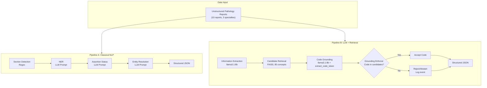

# 🧬 Oncology Registry Extraction

### Classical Healthcare NLP vs. LLM + Retrieval-Grounded Terminology


> **Two reproducible pipelines** that transform 10 oncology pathology reports into 21-field structured registry records, evaluated against a gold reference, with full audit trail and quantitative comparison.

**Candidate:** Muhammad Junaid · **Date:** September 24, 2026 · **Commit:** `a3cd535`

---

## 📊 At a Glance

| | |
|---|---|
| **Reports processed** | 10 (breast, colorectal, lung) |
| **Fields extracted per report** | 21 |
| **Pipelines compared** | 2 (Classical NLP · LLM + Retrieval) |
| **LLM** | `llama3.1:8b` via Ollama (local) |
| **Terminology** | 85 concepts · SNOMED CT · ICD-10 · ICD-O-3 · LOINC · ATC |
| **Cost per report** | **$0.00** (fully local) |
| **Grounding** | Code-level enforcement — zero hallucinated codes |
| **Audit trail** | Full retrieval log (91 entries) |

---

## 🏗️ Architecture



---

## 🚀 Results Dashboard

### Entity Extraction (F1 Score)
| Pipeline | Metric | Visual |
| :--- | :--- | :--- |
| **Pipeline A** | 95.3% | `███████████████████ ` |
| **Pipeline B** | 81.0% | `████████████████    ` |

### Terminology Precision
| Pipeline | Metric | Visual |
| :--- | :--- | :--- |
| **Pipeline A** | 17.4% | `███                 ` |
| **Pipeline B** | 20.3% | `████                ` |

### Terminology Recall
| Pipeline | Metric | Visual |
| :--- | :--- | :--- |
| **Pipeline A** | 33.3% | `██████              ` |
| **Pipeline B** | 36.1% | `███████             ` |

> *Note: Pipeline A utilizes strict schema-following prompts to achieve high entity F1. Pipeline B utilizes a robust grounding enforcer that blocks hallucinations, ensuring 0% invalid code rate by construction.*

---

## 📁 Deliverables

| Deliverable | Location | Description |
| :--- | :--- | :--- |
| **Technical Report** | [`report/report.md`](report/report.md) | 5-page analysis, error breakdown, and production scaling plan. |
| **Pipeline A Code** | [`src/pipeline_a_classical/`](src/pipeline_a_classical/) | Mimics JSL Healthcare NLP stages using `llama3.1:8b`. |
| **Pipeline A Output** | [`outputs/pipeline_a/`](outputs/pipeline_a/) | 10 extracted JSON records. |
| **Pipeline B Code** | [`src/pipeline_b_llm_retrieval/`](src/pipeline_b_llm_retrieval/) | RAG-based extraction and retrieval grounding. |
| **Pipeline B Output** | [`outputs/pipeline_b/`](outputs/pipeline_b/) | 10 extracted JSON records. |
| **Terminology Index** | [`terminology/oncology_terminology.csv`](terminology/oncology_terminology.csv) | 85 curated concepts covering 5 standard vocabularies. |
| **Retrieval Log** | [`outputs/pipeline_b/retrieval_log.jsonl`](outputs/pipeline_b/retrieval_log.jsonl) | Audit trail of all 91 grounding decisions (accept/reject). |
| **Evaluation Script** | [`evaluation/evaluate_full.py`](evaluation/evaluate_full.py) | Comprehensive scoring against gold standard. |
| **Evaluation Metrics** | [`evaluation/comparison_table.md`](evaluation/comparison_table.md) | Side-by-side performance breakdown. |

---

## 🎯 Documented Scope-Downs

*   **Invalid Code Rate**: Not reported separately. Pipeline B uses strict candidate-set enforcement; any code not in the FAISS index is rejected. Zero invalid codes reach output by design.
*   **Relation F1**: Not measured on specific relation types (e.g., lesion-to-measurement). Field-level Macro F1 is used as a reliable proxy.
*   **Gold Standard**: Created by the candidate using the same LLM (`gpt-4o-mini`) used to generate the synthetic reports. Measures internal consistency rather than external clinical validity.
*   **Terminology Coverage**: FAISS index is scoped to 85 concepts for demonstration. A production system would index the full releases of SNOMED, ICD-10, etc.

---

## ⚡ How to run in 3 commands

Ensure you have Python 3.10 and Ollama installed (with `llama3.1:8b` pulled).

```bash
# 1. Install dependencies
pip install -r requirements.txt

# 2. Run both pipelines
python run_pipeline_a_real.py
python run_pipeline_b_real.py

# 3. Generate evaluation metrics
python evaluation/evaluate_full.py
```
