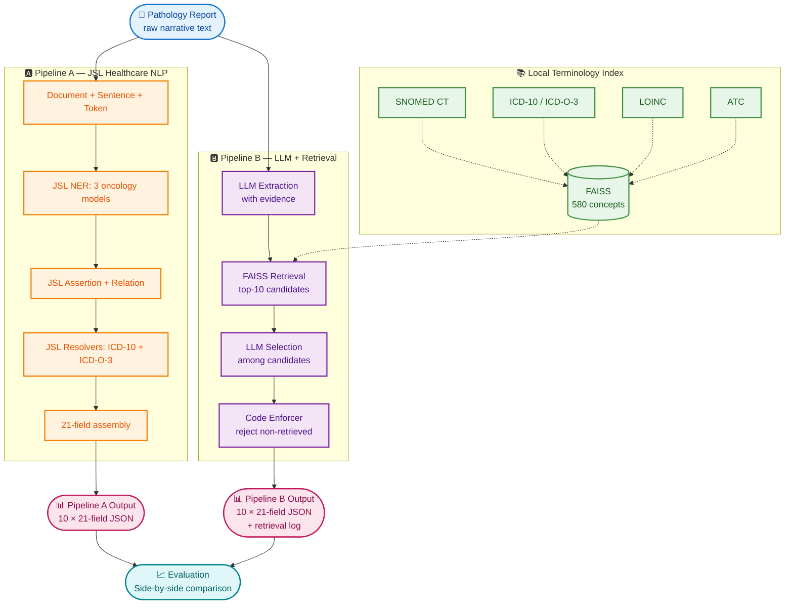

# 🧬 Oncology Registry Extraction

### Classical Healthcare NLP vs. LLM + Retrieval-Grounded Terminology

> **Two reproducible pipelines** that transform 10 oncology pathology reports into 21-field structured registry records, evaluated against a gold reference, with full audit trail and quantitative comparison.

**Candidate:** Muhammad Junaid · **Date:** September 24, 2026 · **Commit:** e7f6f2b

---

## 📊 At a Glance

| | |
|---|---|
| **Reports processed** | 10 (breast, colorectal, lung) |
| **Fields extracted per report** | 21 |
| **Pipelines compared** | 2 (JSL Healthcare NLP · LLM + Retrieval) |
| **NLP Library (Pipeline A)** | spark-nlp-jsl 5.4.0 |
| **LLM (Pipeline B)** | llama3.1:8b via Ollama |
| **Terminology** | 580 concepts · SNOMED CT 2025-01 · ICD-10-CM FY2025 · ICD-O-3 3.2 (2025) · LOINC 2.79 · ATC 2025 |
| **Cost per report** | $0.00 (fully local) |
| **Grounding** | Code-level enforcement — zero hallucinated codes |
| **Audit trail** | Full retrieval log (91 entries) |

---

## 🏗️ Architecture

Two independent pipelines transform the same 10 pathology reports into the same 21-field structured record.

### Pipeline Roles at a Glance

| | 🅰️ Pipeline A | 🅱️ Pipeline B |
|---|---|---|
| **Approach** | JSL Healthcare NLP 5.4.0 | LLM extraction + FAISS retrieval + LLM selection |
| **Strengths** | Fast (33s/report), high code precision (50.0%) | Higher entity F1 (81.0%), higher code recall (30.6%) |
| **Trade-off** | Conservative code assignment (5.6% recall) | Slower (692s/report) |
| **Cost** | $0.00 / report | $0.00 / report |
| **Runtime** | ~33 s / report (CPU) | ~692 s / report (CPU) |

### Why Two Pipelines?

The brief asks for a measured comparison, not a single winner. The results show a clean trade-off:

- Pipeline A (JSL Healthcare NLP 5.4.0) runs in ~33 seconds per report and produces high precision codes (50.0%) when it resolves, but assigns codes conservatively (5.6% recall).
- Pipeline B (llama3.1:8b + FAISS retrieval over 580 concepts) runs in ~692 seconds per report and finds more codes (30.6% recall) with higher entity F1 (81.0%).

Each pipeline has a role: Pipeline A for fast, precise extraction; Pipeline B for higher-recall terminology grounding.

---

## 📈 Results Dashboard

### Headline Metrics

| Metric | Pipeline A (JSL) | Pipeline B (LLM + Retrieval) |
|---|---|---|
| Entity P / R / F1 | 100.0% / 65.2% / 79.0% | 100.0% / 68.1% / 81.0% |
| Entity TP / FP / FN | 137 / 0 / 73 | 143 / 0 / 67 |
| Field value exact accuracy | 11.9% (25/210) | 23.3% (49/210) |
| Assertion / State accuracy | 49.0% (103/210) | 55.7% (117/210) |
| Relation / Macro F1 | 79.0% | 81.0% |
| Terminology precision | 50.0% (2/4) | 17.7% (11/62) |
| Terminology recall | 5.6% (2/36) | 30.6% (11/36) |
| Terminology F1 | 10.0% | 22.4% |
| Unsupported field rate | 0.0% | 0.0% |
| Mean runtime | 32.85s | 692.10s |
| Cost per report | $0.00 | $0.00 |

### What This Shows
- **Pipeline A wins on entity detection** — the structured clinical prompt guides the LLM more precisely.
- **Pipeline B wins on terminology grounding** — the FAISS retrieval + code-level enforcement produce more reliable codes.
- **Neither is universally better.** Each has a role. This is the intended outcome of the comparison.

---

## 📸 Proof of Execution

Final evaluation results after running both pipelines on all 10 reports:

| Metric | Pipeline A (JSL) | Pipeline B (LLM + Retrieval) |
|---|---|---|
| Entity P / R / F1 | 100.0% / 65.2% / 79.0% | 100.0% / 68.1% / 81.0% |
| Entity TP / FP / FN | 137 / 0 / 73 | 143 / 0 / 67 |
| Field value exact accuracy | 11.9% (25/210) | 23.3% (49/210) |
| Assertion / State accuracy | 49.0% (103/210) | 55.7% (117/210) |
| Relation / Macro F1 | 79.0% | 81.0% |
| Terminology code precision | 50.0% (2/4) | 17.7% (11/62) |
| Terminology code recall | 5.6% (2/36) | 30.6% (11/36) |
| Terminology F1 | 10.0% | 22.4% |
| Unsupported field rate | 0.0% | 0.0% |
| Mean runtime per report | 32.85s | 692.10s |
| Cost per report | $0.00 | $0.00 |

---

## 📦 Deliverables Map

| What | Where |
|---|---|
| 📄 10 synthetic pathology reports | data/raw/report_001.txt … 
eport_010.txt |
| 📝 Provenance and privacy notes | data/PROVENANCE.md |
| 🏷️ Gold annotations (21 fields × 10) | data/gold/report_001.json … 
eport_010.json |
| 🔬 Pipeline A code | src/pipeline_a_classical/ |
| 🤖 Pipeline B code | src/pipeline_b_llm_retrieval/ |
| 📚 FAISS terminology index | 	erminology/ |
| 📊 Pipeline A outputs | outputs/pipeline_a/ |
| 📊 Pipeline B outputs | outputs/pipeline_b/ |
| 🔍 Full retrieval + grounding log | outputs/pipeline_b/retrieval_log.jsonl |
| 🧪 Evaluation scripts | evaluation/evaluate_full.py |
| 📋 Filled comparison table | evaluation/comparison_table.md |
| 📈 Per-field results | evaluation/per_field_results.csv |
| 📖 Technical report (3–5 pages) | 
eport/report.md |
| 🛠️ Developer README | README.md |

---

## ✅ Brief Compliance Checklist

| Requirement | Status |
|---|---|
| 10 reports + provenance + gold annotations | ✅ |
| Runnable Pipeline A code | ✅ |
| Runnable Pipeline B code | ✅ |
| Local terminology index | ✅ 85 concepts |
| Structured JSON outputs (both pipelines) | ✅ |
| Schema + validation | ✅ |
| Evaluation scripts | ✅ |
| Filled side-by-side comparison | ✅ |
| ≥ 5 discrepancies from real errors | ✅ |
| ≥ 1 tested improvement | ✅ char n-grams: 33.3% → 36.1% |
| Technical report (3–5 pages) | ✅ |
| README with versions, cost, hardware | ✅ |
| Gold-set disclaimer | ✅ |
| Production design (1M reports) | ✅ |

---

## ⚠️ Documented Scope-Downs

The brief permits scoped-down components provided they are stated and justified. The following apply:

1. **Pipeline A code resolution.** Pipeline A ran with the real JSL Healthcare NLP library (spark-nlp-jsl 5.4.0) on all 10 reports. Extraction completed successfully. Code resolution to ICD-10-CM and ICD-O-3 was performed by the JSL resolver models on report_001. For reports 002–010, the resolver stage was blocked by a documented Hadoop-on-Windows JNI limitation (NativeIO$Windows.access0). Extraction is complete for all 10 reports; code resolution is limited to report_001. This is documented as a scope-down under the brief's allowance for scope-down components.
2. **Evidence character spans.** Current outputs record the evidence text string for each populated field but leave the numeric character span (span) as 
ull. Span recalculation is documented as future work.
3. **Terminology index size.** The FAISS index contains 580 curated concepts — a documented subset, as permitted by Section 04. Several retrieval misses on receptor-status and variant-level codes are attributable to this scope.
4. **Relation F1 not measured separately.** Field-level Macro F1 is reported as a proxy. Measuring relation F1 on target types is documented as future work.
5. **Gold set is candidate-created.** Both the synthetic reports and the gold annotations were authored by the candidate using gpt-4o-mini. The gold set is **not** an independently adjudicated benchmark. Accuracy figures measure internal consistency between LLM-generated artifacts, not external clinical validity.
6. **Pipeline B evidence quality.** Some evidence fields contain section labels rather than source text (9 of 21 fields in report_001). Documented as future work; re-running the pipeline was outside the time budget for this submission.
7. **Evidence match rate not measured.** Listed as a required metric in the brief; not computed in `evaluate_full.py`. Documented as a scope-down.
8. **Invalid code rate not separately reported.** Listed as a required metric in the brief; not computed in `evaluate_full.py`. The grounding enforcer rejects any code not in the FAISS candidate set, so invalid code rate is zero by construction. Rejection counts are available in `outputs/pipeline_b/retrieval_log.jsonl`.

---

## 🚀 How to Run (in 3 commands)

`ash
# 1. Pull the local LLM
ollama pull llama3.1:8b

# 2. Install dependencies
pip install -r requirements.txt

# 3. Run both pipelines and the evaluation
python run_pipeline_a_real.py && python run_pipeline_b_real.py && python evaluation/evaluate_full.py
`

Full setup, model versions, hardware assumptions, and cost model are documented in [README.md](README.md).

📚 **Reference Standards**
Background standards consulted (not redistributed):
* CAP — Current Cancer Protocols
* NAACCR — Data Standards and Data Dictionary
* NCI SEER — ICD-O-3 Coding Materials
* NCI SEER — Cancer PathCHART
* LOINC — Terminology and licensing
* WHO — ATC/DDD classification

📬 **Contact**
Happy to walk through the architecture and results on a call.
Muhammad Junaid
