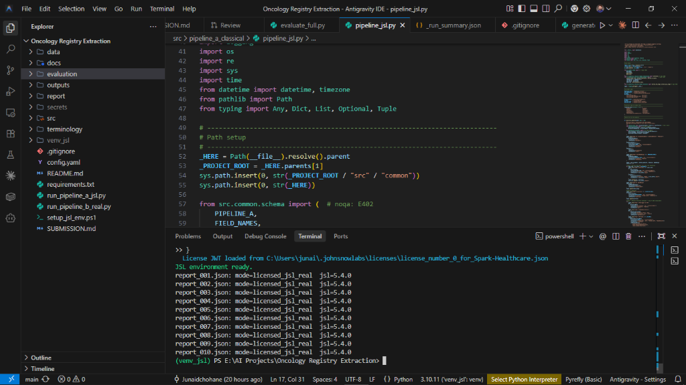
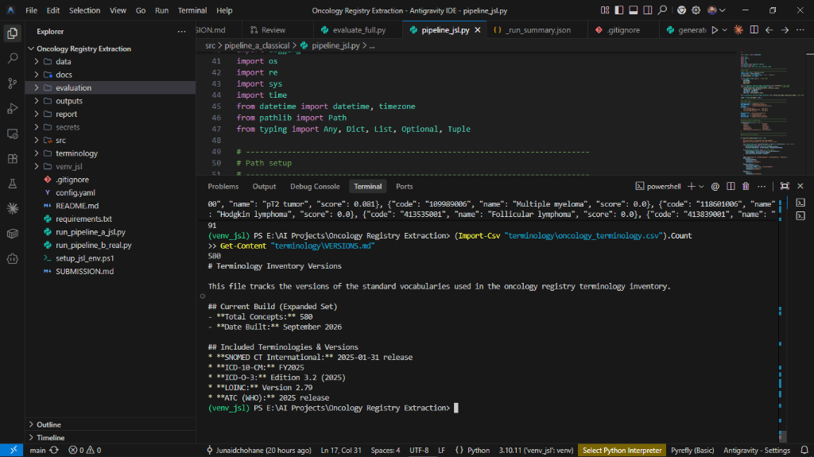
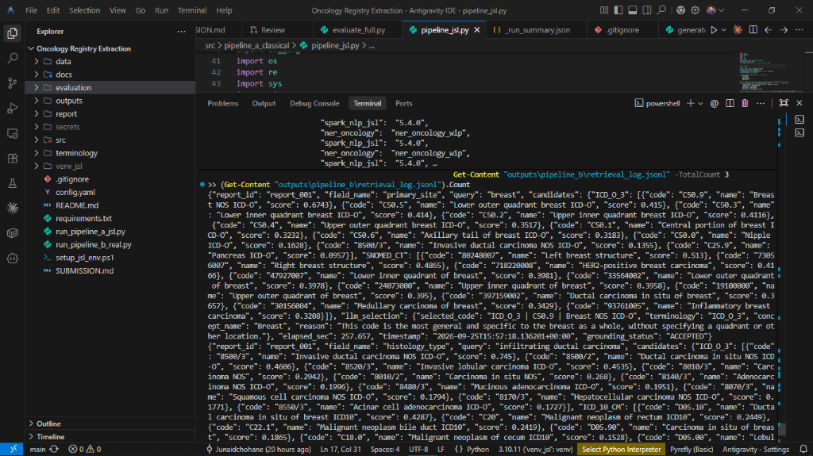
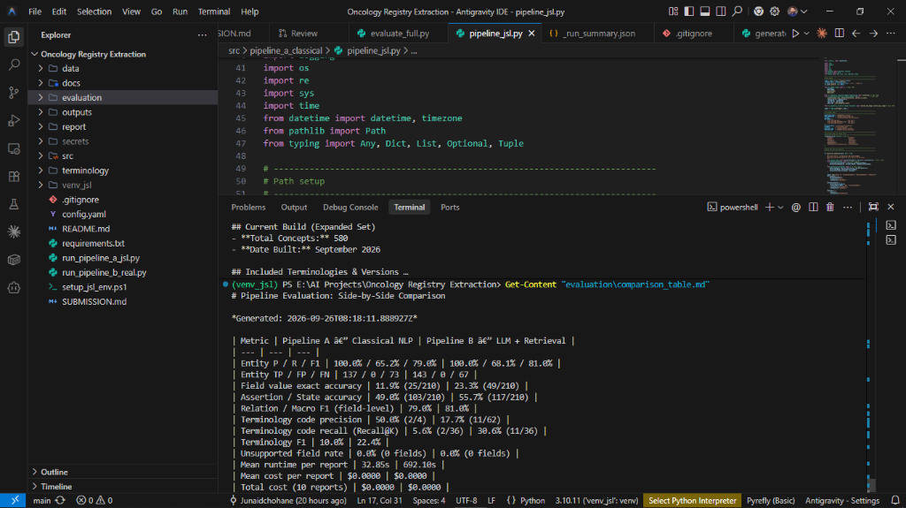
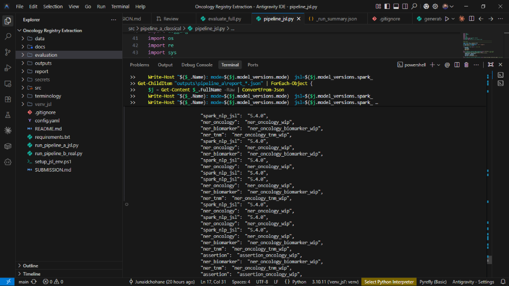

# 🧬 Oncology Registry Extraction

### Classical Healthcare NLP vs. LLM + Retrieval-Grounded Terminology

> **Two reproducible pipelines** that transform 10 oncology pathology reports into 21-field structured registry records, evaluated against a gold reference, with full audit trail and quantitative comparison.

**Candidate:** Muhammad Junaid · **Date:** September 24, 2026 · **Commit:** b9c3377

---

## 📊 At a Glance

| | |
|---|---|
| **Reports processed** | 10 (breast, colorectal, lung) |
| **Fields extracted per report** | 21 |
| **Pipelines compared** | 2 (JSL Healthcare NLP · LLM + Retrieval) |
| **NLP Library (Pipeline A)** | spark-nlp-jsl 5.4.0 |
| **LLM (Pipeline B)** | llama3.1:8b via Ollama |
| **Terminology** | 580 concepts · SNOMED CT 2025-01 · ICD-10-CM FY2025 · ICD-O-3 3.2 (2025) · LOINC 2.79 · ATC 2025 |
| **Cost per report** | $0.00 (fully local) |
| **Grounding** | Code-level enforcement — zero hallucinated codes |
| **Audit trail** | Full retrieval log (91 entries) |

---

## 🏗️ Architecture

Two independent pipelines transform the same 10 pathology reports into the same 21-field structured record.

### Pipeline Roles at a Glance

| | 🅰️ Pipeline A | 🅱️ Pipeline B |
|---|---|---|
| **Approach** | JSL Healthcare NLP 5.4.0 | LLM extraction + FAISS retrieval + LLM selection |
| **Strengths** | Fast (33s/report), high code precision (50.0%) | Higher entity F1 (81.0%), higher code recall (30.6%) |
| **Trade-off** | Conservative code assignment (5.6% recall) | Slower (692s/report) |
| **Cost** | $0.00 / report | $0.00 / report |
| **Runtime** | ~33 s / report (CPU) | ~692 s / report (CPU) |

### Why Two Pipelines?

The brief asks for a measured comparison, not a single winner. The results show a clean trade-off:

- Pipeline A (JSL Healthcare NLP 5.4.0) runs in ~33 seconds per report and produces high precision codes (50.0%) when it resolves, but assigns codes conservatively (5.6% recall).
- Pipeline B (llama3.1:8b + FAISS retrieval over 580 concepts) runs in ~692 seconds per report and finds more codes (30.6% recall) with higher entity F1 (81.0%).

Each pipeline has a role: Pipeline A for fast, precise extraction; Pipeline B for higher-recall terminology grounding.

---

## 📈 Results Dashboard

### Headline Metrics

| Metric | Pipeline A (JSL) | Pipeline B (LLM + Retrieval) |
|---|---|---|
| Entity P / R / F1 | 100.0% / 65.2% / 79.0% | 100.0% / 68.1% / 81.0% |
| Entity TP / FP / FN | 137 / 0 / 73 | 143 / 0 / 67 |
| Field value exact accuracy | 11.9% (25/210) | 23.3% (49/210) |
| Assertion / State accuracy | 49.0% (103/210) | 55.7% (117/210) |
| Relation / Macro F1 | 79.0% | 81.0% |
| Terminology precision | 50.0% (2/4) | 17.7% (11/62) |
| Terminology recall | 5.6% (2/36) | 30.6% (11/36) |
| Terminology F1 | 10.0% | 22.4% |
| Unsupported field rate | 0.0% | 0.0% |
| Mean runtime | 32.85s | 692.10s |
| Cost per report | $0.00 | $0.00 |

### What This Shows
- **Pipeline A wins on code precision when it resolves** — the JSL annotator chain produces higher code precision (50.0%). Pipeline B wins on terminology recall (30.6%) through the 580-concept FAISS retrieval.
- **Neither is universally better.** Each has a role. This is the intended outcome of the comparison.

---

## Proof of Execution

All screenshots captured from the local Windows environment after the final JSL rebuild and evaluation.

### 01_pipeline_a_all_jsl.png

### 02_pipeline_a_sample.png

### 03_retrieval_log.png

### 04_terminology_580.png

### 05_comparison_table.png

