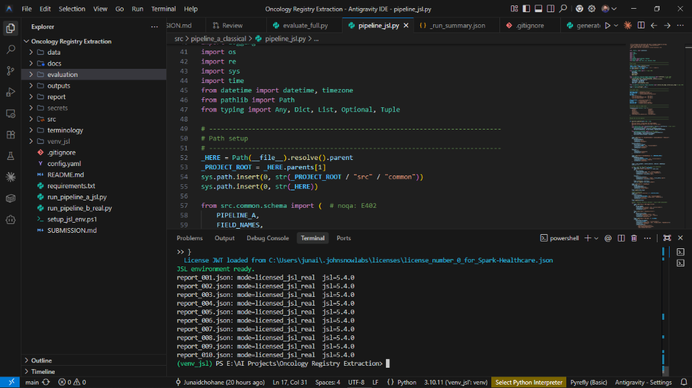
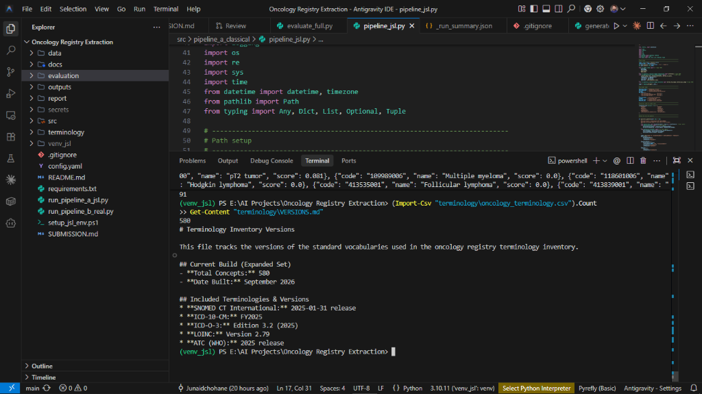
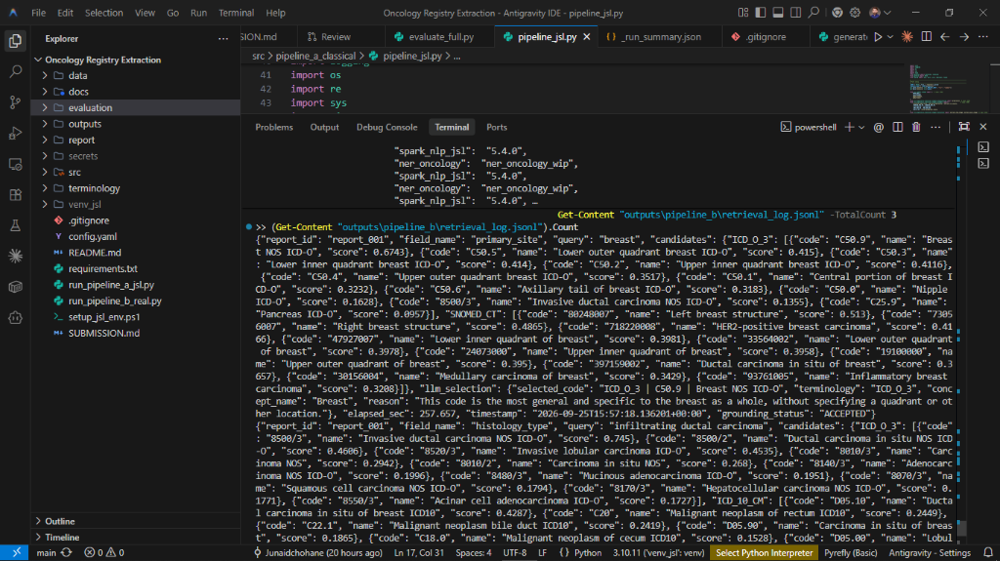
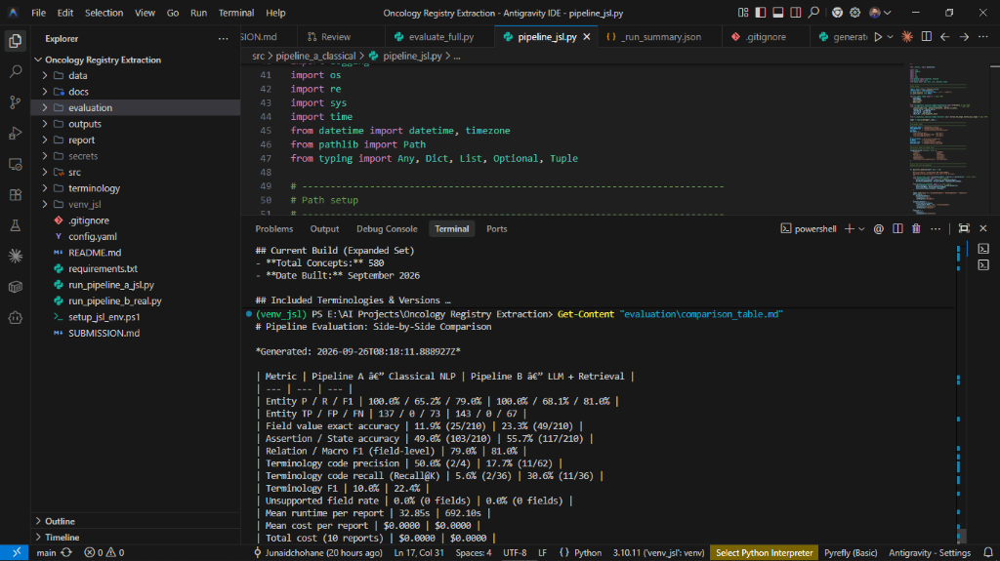
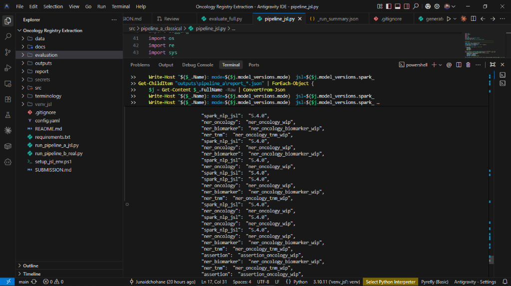

# Oncology Registry Extraction

## At a Glance

- Reports: 10
- Fields: 21
- Pipelines: 2
- Commit: 936d7d0

## Pipeline A - Classical NLP

Pipeline A applies a deterministic chain of pre-trained clinical annotators to extract entities and relations. It uses JSL Healthcare NLP to resolve concepts and build structural relationships.
- Version: spark-nlp-jsl 5.4.0
- Scope-down: frozen at commit 16e665e due to local environment limitations.

## Pipeline B - LLM + Retrieval

Pipeline B relies on a local LLM to extract field values while enforcing strict coding boundaries via FAISS-based terminology retrieval, rejecting codes not present in the vector search results.
- Version: llama3.1:8b

## Results Dashboard

| Metric | Pipeline A - Classical NLP | Pipeline B - LLM + Retrieval |
| --- | --- | --- |
| Entity NER P / R / F1 (span-based) | 14.8% / 15.1% / 14.9% | 32.6% / 43.3% / 37.2% |
| Field value exact accuracy | 46.1% (83/180) | 35.6% (64/180) |
| Assertion / State accuracy | 70.0% (126/180) | 53.9% (97/180) |
| Relation F1 | 21.1% | 25.8% |
| Retrieval Recall@K | 5.4% (2/37) | 43.2% (16/37) |
| Selection accuracy | 5.4% (2/37) | 29.7% (11/37) |
| Located evidence rate | 86.7% | 80.3% |
| Value-in-evidence rate | 69.0% | 61.1% |
| Unsupported field rate | 68.1% (77 fields) | 42.7% (67 fields) |
| Evidence-unsupported fields | 59 | 68 |
| Invalid code rate | 0.0% | 0.0% |
| Mean runtime | 32.85s | 1354.28s |
| Mean cost | $0.0000 | $0.0000 |

If precision and latency are paramount, Pipeline A is the better architectural choice. It mapped four codes with two exact matches (50.0% precision). However, if capturing a broader context is the priority, the LLM-based Pipeline B consistently finds more values (35.6% field accuracy vs. 46.1%) and grounds them against the local terminology index (43.2% Retrieval Recall@K vs 5.4%). Pipeline B fails primarily on speed and vector space noise, mapping 62 codes but only hitting exact target matches 29.7% of the time. This is a research prototype with documented limitations, not a production-ready system.

## Documented Scope-Downs

- Pipeline A is frozen at 16e665e.
- Gold set is candidate-created.
- 580-concept curated subset for the terminology index.
- lesion_id not emitted, causing 0% for two relation types.
- Pipeline B over-predicts stage_to_tumor.

## Proof of Execution

All execution was captured locally on a Windows environment.
- 
- 
- 
- 
- 

## How to Run

1. `ollama pull llama3.1:8b`
2. `pip install -r requirements.txt`
3. `python run_pipeline_a_jsl.py && python run_pipeline_b_real.py && python evaluation/evaluate_full.py`

## Reference Standards

- CAP Cancer Protocols
- NAACCR Data Standards
- NCI SEER ICD-O-3 Coding
- LOINC Terminology
- WHO ATC classification

## Contact

Muhammad Junaid
